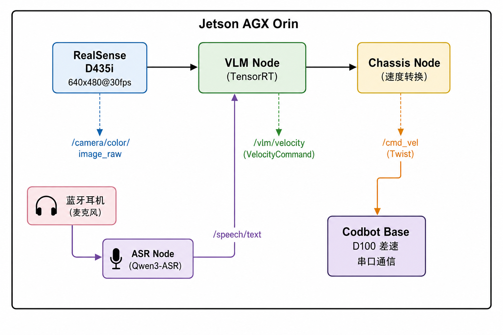

# VLM 智能小车实验

基于视觉语言模型（VLM）的智能小车项目，运行在 NVIDIA Jetson AGX Orin 平台上。
## Demo Video

https://github.com/user-attachments/assets/1513e14d-b42a-4fb9-8eab-1fdb1c9cfd4f
## 大概项目架构



## 环境配置

### 硬件要求

| 组件   | 型号                          | 说明       |
| ---- | --------------------------- | -------- |
| 计算平台 | NVIDIA Jetson AGX Orin 64GB | 主控       |
| 相机   | Intel RealSense D435i       | RGB-D 相机 |
| 底盘   | Codbot D100                 | 差速底盘     |
| 串口   | CH340 USB 转串口               | 底盘通信     |

### 软件依赖

| 组件                | 版本     | 说明       |
| ----------------- | ------ | -------- |
| Ubuntu            | 22.04  | 操作系统     |
| ROS 2             | Humble | 中间件      |
| CUDA              | 12.6   | GPU 计算   |
| TensorRT          | 10.3   | 推理加速     |
| RealSense SDK     | 2.57.7 | 相机驱动     |
| TensorRT-Edge-LLM | 0.7.0  | LLM 推理引擎 |

### TensorRT-Edge-LLM环境搭建教程：
https://nvidia.github.io/TensorRT-Edge-LLM/latest/overview.html

### 模型下载：
语音转文字ASR：
https://huggingface.co/Qwen/Qwen3-ASR-0.6B

VLM大模型：
https://huggingface.co/nvidia/Cosmos-Reason2-2B

导出并量化参考：
https://nvidia.github.io/TensorRT-Edge-LLM/latest/user_guide/features/quantization.html

c++API参考：
https://nvidia.github.io/TensorRT-Edge-LLM/latest/cpp_api.html

## 模型说明
## 1. 模型文件大小对比

### 1.1 LLM 引擎

| 指标 | FP16 | INT4 | 压缩比 |
|------|------|------|--------|
| 引擎文件 | 3.3 GB | 1.3 GB | **60.6%** |
| 嵌入文件 | 594 MB | 594 MB | 0% |
| **总计** | **3.9 GB** | **1.9 GB** | **51.3%** |

### 1.2 视觉编码器引擎

| 指标 | FP16 | INT4 | 压缩比 |
|------|------|------|--------|
| 引擎文件 | 786 MB | 786 MB | 0% |

> **注**: 视觉编码器保持 FP16 精度，未进行 INT4 量化。

### 1.3 总存储占用

| 版本 | LLM | 视觉 | 总计 |
|------|-----|------|------|
| FP16 | 3.9 GB | 786 MB | **4.7 GB** |
| INT4 | 1.9 GB | 786 MB | **2.7 GB** |
| 节省 | 2.0 GB | 0 | **2.0 GB (42.6%)** |

---

## 2. 模型架构参数

两个版本使用相同的模型架构：

| 参数 | 值 |
|------|-----|
| 模型类型 | Qwen3-VL |
| 参数量 | 2B |
| 隐藏层大小 | 2048 |
| 注意力头数 | 16 |
| KV 头数 | 8 (GQA) |
| 隐藏层数 | 28 |
| 中间层大小 | 6144 |
| 词表大小 | 151,936 |
| 最大输入长度 | 4096 tokens |
| 最大 KV Cache | 8192 |
| 视觉编码器 | 24 层, 1024 隐藏, 16 头 |
| 视觉特征融合 | DeepStack (层 5, 11, 17) |
| 图像块大小 | 16x16 |
| 空间合并大小 | 2x2 |

---

## 3. 推理性能测试

### 3.1 测试环境

| 项目 | 配置 |
|------|------|
| 平台 | NVIDIA Jetson AGX Orin 64GB |
| GPU | 2048 CUDA cores, 64 Tensor cores |
| SM 架构 | SM 8.7 (Ampere) |
| CUDA | 12.6 |
| TensorRT | 10.3 |
| 推理框架 | TensorRT-Edge-LLM 0.7.0 |
| 系统内存 | 64 GB LPDDR5 |
| GPU 内存 | 与系统共享 (最大 32 GB) |

### 3.2 测试方法

```bash
# 测试脚本: 记录推理时间
# 1. 启动 VLM 节点
# 2. 发送测试图像和提示词
# 3. 记录从图像输入到结果输出的时间
# 4. 重复多次取平均值
```

### 3.3 推理延迟对比

| 指标 | FP16 | INT4 | 提升 |
|------|------|------|------|
| 单次推理延迟 | ~1.5s | ~0.75s | **2.0x** |
| 推理 FPS | ~0.67 | ~1.33 | **2.0x** |
| 首 token 延迟 | ~0.8s | ~0.4s | **2.0x** |

### 3.4 GPU 内存占用

| 指标 | FP16 | INT4 | 节省 |
|------|------|------|------|
| 引擎加载内存 | ~4.5 GB | ~2.5 GB | **44.4%** |
| 推理峰值内存 | ~6.0 GB | ~3.5 GB | **41.7%** |
| KV Cache 占用 | ~1.0 GB | ~1.0 GB | 0% |

### 3.5 吞吐量测试

| 测试项 | FP16 | INT4 | 提升 |
|--------|------|------|------|
| 连续推理 10 次 | 15.0s | 7.5s | **2.0x** |
| 平均单次 | 1.50s | 0.75s | **2.0x** |
| 标准差 | ±0.15s | ±0.08s | - |

## 编译
### 1. 编译接口包
```bash

cd /path/bot_project

mkdir -p build/bot_interfaces install/bot_interfaces

cd build/bot_interfaces

source /opt/ros/humble/setup.bash

cmake ../../src/bot_interfaces \

  -DCMAKE_INSTALL_PREFIX=/path/bot_project/install/bot_interfaces \

  -DCMAKE_PREFIX_PATH=/opt/ros/humble

make -j$(nproc)

make install

```
  

### 2. 编译 d435i相机ros，realsense-ros

```bash

cd /path/VLM_project/realsense-ros

mkdir -p build install

cd build

source /opt/ros/humble/setup.bash

cmake .. -DCMAKE_INSTALL_PREFIX=/home/nvidia/VLM_project/realsense-ros/install -DCMAKE_PREFIX_PATH=/opt/ros/humble

make -j$(nproc)

make install

```
### 3. 编译 VLM 节点

```bash

cd /path/VLM_project/bot_project

mkdir -p build/bot_vlm install/bot_vlm

cd build/bot_vlm

source /opt/ros/humble/setup.bash

cmake ../../src/bot_vlm \

  -DCMAKE_INSTALL_PREFIX=/path/VLM_project/bot_project/install/bot_vlm \

  -DCMAKE_PREFIX_PATH="/opt/ros/humble;/path/bot_project/install/bot_interfaces"

make -j$(nproc)

make install

```
### 4. 编译语音识别节点（bot_speech）

语音识别节点需要额外依赖 FFTW3（快速傅里叶变换）用于音频预处理。

```bash

# 安装依赖

sudo apt-get install -y libfftw3-dev libasound2-dev

  

# 编译

cd /path/VLM_project/bot_project

colcon build --packages-select bot_interfaces bot_speech

```
### 5. 编译底盘控制节点

  

```bash

cd /home/nvidia/VLM_project/bot_project

mkdir -p build/bot_chassis install/bot_chassis

cd build/bot_chassis

source /opt/ros/humble/setup.bash

cmake ../../src/bot_chassis \

  -DCMAKE_INSTALL_PREFIX=/home/nvidia/VLM_project/bot_project/install/bot_chassis \

  -DCMAKE_PREFIX_PATH="/opt/ros/humble;/home/nvidia/VLM_project/bot_project/install/bot_interfaces"

make -j$(nproc)

make install

```
### 6. 编译 Codbot 底盘驱动

```bash

cd /path/VLM_project/codbot_base

mkdir -p build install

cd build

source /opt/ros/humble/setup.bash

cmake .. -DCMAKE_INSTALL_PREFIX=/自己小车的/codbot_base/install -DCMAKE_PREFIX_PATH=/opt/ros/humble

make -j$(nproc)

make install

```
## 目录结构

```
bot_project/
├── src/
│   ├── bot_interfaces/             # 自定义消息/服务
│   │   ├── msg/
│   │   │   ├── VLMResult.msg       # VLM 推理结果
│   │   │   └── VelocityCommand.msg # 速度控制指令
│   │   ├── srv/
│   │   │   └── VLMQuery.srv        # VLM 查询服务
│   │   ├── CMakeLists.txt
│   │   └── package.xml
│   │
│   ├── bot_vlm/                    # VLM 推理节点
│   │   ├── include/bot_vlm/
│   │   │   └── vlm_node.hpp
│   │   ├── src/
│   │   │   ├── vlm_node.cpp
│   │   │   └── cuda_helper.cu
│   │   ├── launch/
│   │   ├── config/
│   │   ├── CMakeLists.txt
│   │   └── package.xml
│   │
│   ├── bot_chassis/                # 底盘控制节点
│   │   ├── include/bot_chassis/
│   │   │   └── chassis_node.hpp
│   │   ├── src/
│   │   │   └── chassis_node.cpp
│   │   ├── launch/
│   │   ├── config/
│   │   ├── CMakeLists.txt
│   │   └── package.xml
│   │
│   └── bot_speech/                 # 语音识别节点
│       ├── include/bot_speech/
│       │   ├── speech_node.hpp
│       │   └── audio_preprocessor.hpp
│       ├── src/
│       │   ├── speech_node.cpp
│       │   ├── audio_preprocessor.cpp
│       │   └── cuda_helper.cu
│       ├── launch/
│       ├── config/
│       ├── CMakeLists.txt
│       └── package.xml
│
├── gui/
│   └── vlm_gui.py                  # PyQt5 GUI 控制面板
│
├── launch/
│   └── vlm_pipeline.launch.py      # 完整管线启动文件
│
├── scripts/
│   └── *.sh                        # 启动脚本
│
└── README.md
```


## 许可证

MIT License
